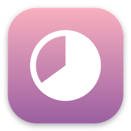
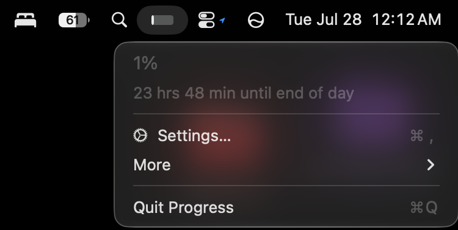
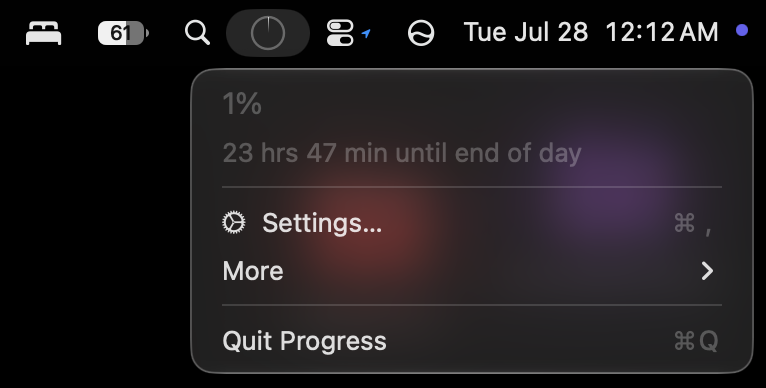

<div align="center">



# ✨ Progress ✨

### a lil menu bar buddy that watches your day go by

[](https://github.com/GeethanKE/Progress/releases/latest/download/Progress.dmg)

*no coding, no terminal, no scary stuff — just click and go *

</div>

<br>

## what even is this 🥹

Progress lives quietly up in your Mac's menu bar (next to your wifi, battery,
all that) and shows you **how much of your day is gone** — as a lil pie that
fills up, or a bar, whatever's cuter to you.

That's it. That's the whole app. No accounts, no ads, no tracking, no popups
begging you to subscribe to anything. It just sits there being aesthetic and
useful 🎀

<br>

## how to install it 💫

1. Click the pink **Download** button up top ⬆️
2. A file called `Progress.dmg` lands in your Downloads — double click it
3. A little window pops up, drag the **Progress** icon onto the **Applications**
   folder icon (there's literally an arrow showing you where lol)
4. Close that window, then open **Launchpad** or **Spotlight** (`⌘ + Space`)
   and type "Progress" — click it to open

**one weird extra step the first time only:** your Mac might say it can't
verify the developer (that's just because I'm one (1) person and not a whole
company paying Apple $$$ every year, not because anything's wrong 🫶). If that
happens:

- right-click the Progress icon → click **Open** → click **Open** again when
  it asks — and that's it, forever, you'll never see that again

That's genuinely it. You're done. Look up at your menu bar 

<br>

## or if you're a terminal person 🖤

If you already have [Homebrew](https://brew.sh) installed, skip all of that
and just run:

```bash
brew install --cask geethanke/progress/progress
```

Same app, same everything, it just skips the Gatekeeper right-click step
since Homebrew handles that for you. To update later:

```bash
brew upgrade --cask progress
```

<br>

## making it yours 💌

Click the icon up top any time to see:

Open **Settings…** to give it a cute label and pick when your "day" starts
and ends — defaults to midnight → midnight so it just works right away, but
make it a workday, a countdown to vacation, whatever you want it to track 🌷

Want it to open automatically every time you turn your Mac on? Go to
**System Settings → General → Login Items** and add Progress there.

<br>

<div align="center">

&nbsp;

</div>

<br>

## why does it look so plain / why is there no color 🤍

That's on purpose! It's built to match Apple's own menu bar icons (like your
battery or wifi symbol) so it feels like it's actually part of your Mac,
not some random app slapped on top. It even flips light/dark automatically
depending on your wallpaper and dark mode settings ✨

<br>

## it's private

Everything — your start time, end time, all of it — lives only on your own
Mac. Nothing gets sent anywhere, there's no internet connection happening at
all. It's just a lil clock, minding its business.

<br>

---

<br>

<details>
<summary><b>🛠️ for the developers / curious people (click to expand)</b></summary>

<br>

### building it yourself instead of downloading

```bash
git clone https://github.com/GeethanKE/Progress.git
cd Progress
./scripts/build-dmg.sh   # builds Progress.dmg locally
# or:
swift run -c release     # just run it directly, no packaging
```

Requires macOS 12+ and Swift 5.9+ / Xcode 15+.


### how the progress calculation works simmple math

```
fraction = (now - startDate) / (endDate - startDate)
```

Clamped to `[0, 1]`. The icon and menu redraw exactly when the clock's
minute value changes (aligned to real minute boundaries via
`Calendar.nextDate`), not on a blind interval — so there's no wasted work
and no lag behind the actual time.

Default range is midnight → 11:59:59 PM of the current day. All settings
persist via `UserDefaults`.

### releasing a new version

Every push of a `v*.*.*` tag triggers `.github/workflows/release.yml`,
which builds `Progress.app`, wraps it into `Progress.dmg`, and attaches it
to a new GitHub Release. The version number is read straight from the git
tag (`v1.0.2` → `1.0.2`), so there's nothing to edit by hand.

```bash
git tag v1.0.2
git push origin v1.0.2
```

To undo a bad tag/release before retagging:

```bash
gh release delete v1.0.2 --yes         # or delete it on github.com
git push origin :refs/tags/v1.0.2
git tag -d v1.0.2
```

### Homebrew Cask (one-time setup)

`brew install --cask geethanke/progress/progress` works because Homebrew
looks for a repo named `homebrew-<tapname>` — in this case
`GeethanKE/homebrew-progress` — containing a `Casks/progress.rb` file.
`release.yml` keeps that file up to date automatically on every tagged
release, but it needs to exist and have write access granted once:

1. Create a new **public** repo on GitHub named exactly `homebrew-progress`
   (empty is fine — the workflow creates `Casks/progress.rb` itself the
   first time it runs).
2. Create a
   [fine-grained personal access token](https://github.com/settings/personal-access-tokens/new)
   scoped only to that `homebrew-progress` repo, with **Contents:
   Read and write** permission.
3. In the `Progress` repo, go to **Settings → Secrets and variables →
   Actions → New repository secret**, name it `HOMEBREW_TAP_TOKEN`, and
   paste the token in.
4. Push a new tag — the release workflow will clone `homebrew-progress`,
   write/update `Casks/progress.rb` with the new version and checksum, and
   push the commit automatically. No further manual steps after that.

If `HOMEBREW_TAP_TOKEN` isn't set, that step is skipped silently — the DMG
release still works fine, Homebrew installs just won't be available yet.

### roadmap

- [ ] Multiple saved presets (e.g. "Workday", "Sprint", "Vacation countdown")
- [ ] Optional notification when the end time is reached
- [ ] Recurring daily ranges (e.g. always 9–5 on weekdays)

### contributing

Issues and PRs welcome. Keep it lightweight — this is meant to stay a
single-purpose utility, not grow into a full task manager.

</details>

<br>

<div align="center">

MIT licensed — see [LICENSE](LICENSE) 

</div>
